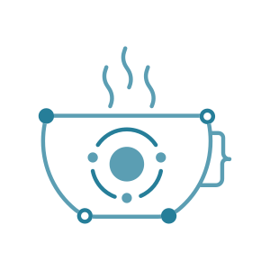
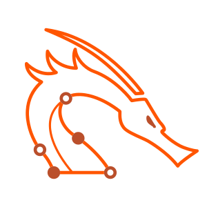
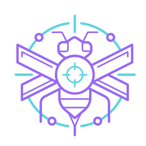
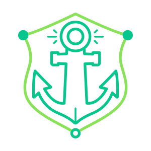
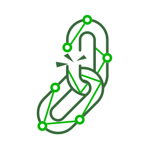
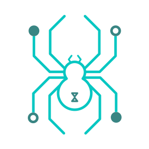
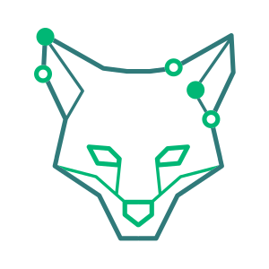

<!-- OFFSEC PROFILE README -->

  
  
  
  # About OffSec Services Limited
  
  _Cybersecurity | Penetration Testing | Red Teaming | OSINT_
  
  
  

## 🎯 About OffSec

[**Offensive Security (OffSec)**](https://www.offsec.com)  is a global leader in cybersecurity education, built on a commitment to excellence, integrity, and growth. From our beginnings to today, we've empowered individuals and organizations to outsmart cyber threats, earning recognition and trust worldwide.

Founded by renowned security experts, OffSec offers industry-leading training programs that prepare cybersecurity professionals for real-world challenges. Their certifications, such as the prestigious **Offensive Security Certified Professional (OSCP)**, are widely respected by employers and organizations worldwide.

### 🔐 Core Philosophy

> **Learn by Doing** - OffSec believes in practical, hands-on training that simulates real-world scenarios, enabling students to develop genuine expertise through immersive experiences.

## 🏆 OffSec Awards & Recognitions

### CORE: Creating Outstanding Results Everyday

OffSec's CORE Award is a special honor that recognizes team members who do great work every day.

### Industry Recognition & Awards

#### 2024 Awards

<table>
  <tr>
    <td width="33%" style="border: 1px solid #ddd; padding: 10px;">
      <strong>Hot Company Breach & Attack Simulation</strong> 
      
    </td>
    <td width="33%" style="border: 1px solid #ddd; padding: 10px;">
      <strong>Next Gen Cybersecurity Education— for Enterprises</strong> 
      
    </td>
    <td width="33%" style="border: 1px solid #ddd; padding: 10px;">
      <strong>Market Leader Cybersecurity Education— for Governments</strong> 
      
    </td>
  </tr>
  <tr>
    <td width="33%" style="border: 1px solid #ddd; padding: 10px;">
      <strong>Cutting Edge Cybersecurity Education— for SMBs</strong> 
      
    </td>
    <td width="33%" style="border: 1px solid #ddd; padding: 10px;">
      <strong>Most Innovative Cybersecurity Service Provider</strong> 
      
    </td>
    <td width="33%" style="border: 1px solid #ddd; padding: 10px;">
      <strong>Editor's Choice Cybersecurity Training</strong> 
      
    </td>
  </tr>
  <tr>
    <td width="33%" style="border: 1px solid #ddd; padding: 10px;">
      <strong>Editor's Choice Cybersecurity Training Videos</strong> 
      
    </td>
    <td width="33%" style="border: 1px solid #ddd; padding: 10px;">
      <strong>Best Cybersecurity Education Provider</strong> 
      
    </td>
    <td width="33%" style="border: 1px solid #ddd; padding: 10px;">
      <strong>Best Cybersecurity Certification: PEN-200 (OSCP)</strong> 
      
    </td>
  </tr>
  <tr>
    <td width="33%" style="border: 1px solid #ddd; padding: 10px;">
      <strong>Cybersecurity Training: Learn Enterprise</strong> 
      
    </td>
  </tr>
</table>

#### 2023 Awards

<table>
  <tr>
    <td width="50%" style="border: 1px solid #ddd; padding: 10px;">
      <strong>#8 Best Large Company for Remote Workers</strong> 
      
    </td>
  </tr>
</table>

#### 2022 Awards

<table>
  <tr>
    <td width="50%" style="border: 1px solid #ddd; padding: 10px;">
      <strong>EXP-301: Best Professional Certification Program</strong> 
      
    </td>
  </tr>
</table>

---

## 🏆 OffSec Certifications & Courses

### The OffSec Legends

Inspired by OffSec's world-renowned certifications, these powerful guides lead you through **The Gauntlet**, assigning missions, sharing wisdom, and calling on you to rise beside them to secure victory.

<table>
<tr>
<td align="center" width="20%">

### [OSCP](https://www.offsec.com/courses/pen-200/)  
  

</td>
<td align="center" width="20%">

### [OSEP](https://www.offsec.com/courses/pen-300/)  
  

</td>
<td align="center" width="20%">

### [OSWA](https://www.offsec.com/courses/web-200/)  
  
</td>
<td align="center" width="20%">

### [OSWE](https://www.offsec.com/courses/web-300/)  
  
</td>
<td align="center" width="20%">

### [OSED](https://www.offsec.com/courses/exp-301/)  
  
</td>
</tr>

<tr>
<td align="center" width="20%">

### [OSEE](https://www.offsec.com/courses/exp-401/)  
  
</td>
<td align="center" width="20%">

### [OSDA](https://www.offsec.com/courses/soc-200/)  
  
</td>
<td align="center" width="20%">

### [OSTH](https://www.offsec.com/courses/th-200/)  
  
</td>
<td align="center" width="20%">

### [OSIR](https://www.offsec.com/courses/ir-200/)  
  
</td>
</tr>
</table>

### Course certification badge

Here are the course outlines available in this repository:

<table>
<tr>
<td align="center" width="20%">

### [SEC-100 (OSCC-SEC)](https://www.offsec.com/courses/sec-100/)

</td>
<td align="center" width="20%">

### [SJD-100 (OSCC-SJD)](https://www.offsec.com/courses/sjd-100/)

</td>
<td align="center" width="20%">

### [PEN-200 (OSCP/OSCP+)](https://www.offsec.com/courses/pen-200/)

</td>
<td align="center" width="20%">

### [TH-200 (OSTH)](https://www.offsec.com/courses/th-200/)

</td>
<td align="center" width="20%">

### [WEB-200 (OSWA)](https://www.offsec.com/courses/web-200/)

</td>
</tr>

<tr>
<td align="center" width="20%">

### [IR-200 (OSIR)](https://www.offsec.com/courses/ir-200/)

</td>
<td align="center" width="20%">

### [SOC-200 (OSDA)](https://www.offsec.com/courses/soc-200/)

</td>
<td align="center" width="20%">

### [PEN-210 (OSWP)](https://www.offsec.com/courses/pen-210/)

</td>
<td align="center" width="20%">

### [PEN-300 (OSEP)](https://www.offsec.com/courses/pen-300/)

</td>
<td align="center" width="20%">

### [WEB-300 (OSWE)](https://www.offsec.com/courses/web-300/)

</td>
</tr>

<tr>
<td align="center" width="20%">

### [EXP-301 (OSED)](https://www.offsec.com/courses/exp-301/)

</td>
<td align="center" width="20%">

### [EXP-312 (OSMR)](https://www.offsec.com/courses/exp-312/)

</td>
<td align="center" width="20%">

### [EXP-401 (OSEE)](https://www.offsec.com/courses/exp-401/)

</td>
</tr>
</table>

---
## 📚 Complete OffSec Course Catalog

Here is the complete catalog of OffSec courses organized by specialization tracks:

#### 🔐 Penetration Testing

<table>
<tr>
<td align="center" width="20%">

### [PEN-200: Penetration Testing with Kali Linux ](https://www.offsec.com/courses/pen-200/)

<em>OSCP+</em>

</td>
<td align="center" width="20%">

### [PEN-300: Evasion Techniques and Breaching Defenses](https://www.offsec.com/courses/pen-300/)

<em>OSEP</em>

</td>
</tr>
</table>

#### 💻 Exploit Development

<table>
<tr>
<td align="center" width="20%">

### [EXP-301: Windows User Mode Exploit Development](https://www.offsec.com/courses/exp-301/)

<em>OSED</em>

</td>
<td align="center" width="20%">

### [EXP-401: Advanced Windows Exploitation](https://www.offsec.com/courses/exp-401/)

<em>OSEE</em>

</td>
</tr>
</table>

#### 🌐 Web Application Security

<table>
<tr>
<td align="center" width="20%">

### [WEB-200: Web Attacks with Kali Linux](https://www.offsec.com/courses/web-200/)

<em>OSWA</em>

</td>
<td align="center" width="20%">

### [WEB-300: Advanced Web Attacks and Exploitation](https://www.offsec.com/courses/web-300/)

<em>OSWE</em>

</td>
</tr>
</table>

#### 🛡️ Defensive Security

<table>
<tr>
<td align="center" width="20%">

### [SOC-200: Security Operations and Defensive Analysis](https://www.offsec.com/courses/soc-200/)

<em>OSDA</em>

</td>
<td align="center" width="20%">

### [IR-200: Foundational Incident Response](https://www.offsec.com/courses/ir-200/)

<em>OSIR</em>

</td>
<td align="center" width="20%">

### [TH-200: Foundational Threat Hunting](https://www.offsec.com/courses/th-200/)

<em>OSTH</em>

</td>
</tr>
</table>

#### 🎓 OffSec CyberCore™

<table>
<tr>
<td align="center" width="20%">

### [SEC-100: Cybersecurity Essentials](https://www.offsec.com/courses/sec-100/)

<em>OSCC-SEC</em>

</td>
<td align="center" width="20%">

### [SJD-100: Secure Java Development Essentials](https://www.offsec.com/courses/sjd-100/)

<em>OSCC-SJD</em>

</td>
</tr>
</table>

---

---

## 🛠 Technical Expertise

### Core Competencies
- **Cybersecurity Research & Development**
- **Penetration Testing & Red Teaming**
- **Open-source Intelligence (OSINT)**
- **Software Development & Automation**
- **Linux System Engineering**

### Current Focus Areas
- Rust Programming Language
- Advanced Bash Scripting
- PowerShell for Active Directory Management
- Kubernetes Security & Deployment

### Platform Proficiencies

---

## 🤝 Collaboration Interests

I'm actively seeking collaborations in the following areas:

- **Security Tool Development** - Creating cutting-edge tools for penetration testing and security research
- **Open-source Projects** - Contributing to and maintaining security-focused open-source initiatives
- **Enterprise Software Development** - Building robust, secure enterprise solutions

---

## 📊 GitHub Statistics

### 🏆 GitHub Trophies

### 🏆 GitHub Profile Summary & Contributions

<table>
  <tr>
    <td width="35%">
      
    </td>
    <td width="35%">
      
    </td>
  </tr>
  <tr>
    <td width="35%">
      
    </td>
    <td width="35%">
      
    </td>
  </tr>
  <tr>
    <td colspan="2">
      
    </td>
  </tr>
</table>

---

## 📞 Contact Information

For professional inquiries and collaborations, I can be reached through encrypted channels:

- **Tox:** `6E4F7D0C86D95FAF946FAFF1D59342447BD3AFF8337F5D77E08DCACF5F7F4A0BA98AAFFFE51C`

---

## 🔒 Recommended Encrypted Communication Software

1. **Mattermost Enterprise Edition**  
2. **Wire-Server**  
3. **Signal-Server**  
4. **Zulip Enterprise Edition**  
5. **Rocket.Chat**  
6. **Tox**  
7. **Jami**

---

## 🛡️ Open-Source Alternatives to Okta for Private Deployment

If you're looking for open-source alternatives to Okta with support for private deployment, consider the following options. These tools provide similar Identity and Access Management (IAM) features and can be deployed on your own infrastructure:

1. **[Keycloak](https://www.keycloak.org/):**  
   - Comprehensive open-source IAM solution with SSO, MFA, LDAP/Active Directory integration, social login, and user management.  
   - Supports deployment on enterprise servers, private clouds, or via Docker containers.

2. **[Gluu](https://gluu.org/):**  
   - Open-source IAM platform with SSO, MFA, OAuth2, OpenID Connect, and LDAP integration.  
   - Deployable on your hardware, VMs, or containers, with Kubernetes support.

3. **[Authentik](https://goauthentik.io/):**  
   - Modern open-source IAM platform with SSO, OAuth2, LDAP integration, and a user-friendly management interface.  
   - Suitable for modern infrastructure with Docker and Kubernetes deployment support.

4. **[Authelia](https://www.authelia.com/):**  
   - Open-source two-factor authentication gateway supporting OAuth2, OpenID Connect, and LDAP.  
   - Easily deployable via Docker or Ansible for various environments.

5. **[WSO2 Identity Server](https://wso2.com/identity-and-access-management/):**  
   - Open-source enterprise-level IAM solution supporting SSO, MFA, OAuth2, OpenID Connect, SAML 2.0, etc.  
   - Deployable in local environments, including on-premises servers or cloud VMs.

6. **[Apache Syncope](https://syncope.apache.org/):**  
   - Open-source IAM system focused on user management and access control, with governance and reporting capabilities.  
   - Deployable in local data centers or private clouds, supporting Docker deployments.

7. **[FreeIPA](https://www.freeipa.org/):**  
   - Integrated open-source identity management solution suitable for Linux/Unix environments, providing SSO, host, and service identity management, and certificate management.  
   - Supports deployment in private networks, designed for Unix/Linux integration.

8. **[CAS (Central Authentication Service)](https://apereo.github.io/cas/):**  
   - Robust open-source SSO solution supporting OAuth2, SAML, OpenID Connect, etc.  
   - Flexible integration and configuration options for private IT infrastructure deployment.

9. **[ForgeRock Access Management (Community Edition)](https://www.forgerock.com/):**  
   - Comprehensive IAM features, including SSO, MFA, API security management.  
   - Deployable on-premises and in private cloud environments, with core functionalities covered in the community edition.

10. **[Shibboleth](https://shibboleth.net/):**  
    - Widely used in academia, open-source identity provider, and service provider solution supporting SAML2 protocol.  
    - Deployable on private servers, ideal for environments requiring high security and collaboration.

These open-source IAM solutions offer powerful user authentication, single sign-on, multi-factor authentication, and user management features. They support private deployment and are suitable for running on your own servers or in private cloud environments. Choose the right tool based on your specific needs and technical environment.

  
  ---
  
  _This repository is special because its `README.md` appears on your GitHub profile._
  
  
  

